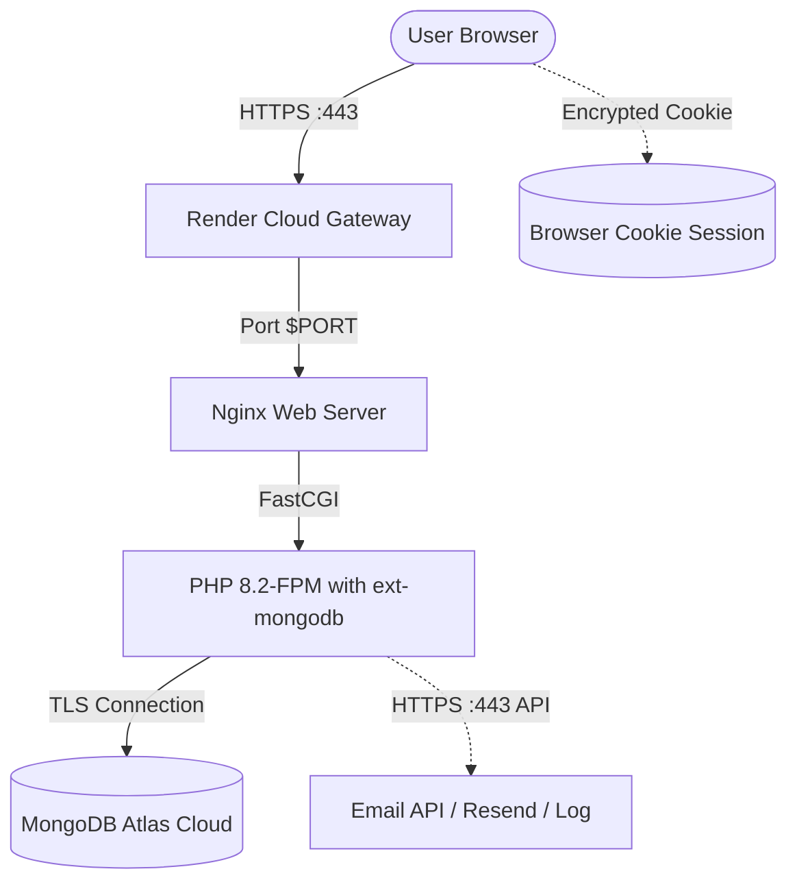

# 🚀 Veytrix — Free ($0) Deployment Guide on Render (Demo / Portfolio / FYP)

This guide provides step-by-step instructions to deploy **Veytrix — Enterprise Customer Relationship & Workflow Management System** (Laravel 12 + MongoDB Atlas + Nginx) to **Render's Free Tier** for **$0 cost**, optimized for portfolio showcases, university final-year projects (FYP), and client demonstrations.

---

## ⚠️ Render Free Tier Realities & Architecture

Before deploying, keep these 3 technical realities in mind:

| Render Free Characteristic | Behavior | Our $0 Solution |
| :--- | :--- | :--- |
| **🚨 SMTP Ports Blocked** | Render Free blocks outbound traffic on ports **25, 465, and 587**. Standard Gmail SMTP (`smtp.gmail.com:587`) will timeout on Render Free. | Use **`MAIL_MAILER=log`** for instant zero-setup demo (emails written to Render logs), or an **HTTPS-based Email API** (e.g. Resend / Brevo via HTTPS port 443). |
| **🚨 Ephemeral Filesystem** | Render Free instances spin down after 15 minutes of inactivity. Any files stored locally on the container disk are wiped when the container restarts. | Use **`SESSION_DRIVER=cookie`**. Session payloads are encrypted and stored in the user's browser cookie. When Render wakes up, the user stays logged in! MongoDB Atlas handles all business data externally. |
| **⏳ 15-Min Inactivity Sleep** | Free services sleep after 15 minutes without requests and take ~50–60 seconds to spin back up on the next visit. | Normal for Render Free. Once awake, performance is snappy. |



---

## 📋 Prerequisites

1. **GitHub Account**: Your repository [github.com/arhamarif7272/Veytrix-CRM](https://github.com/arhamarif7272/Veytrix-CRM).
2. **Render Account**: Free account at [render.com](https://render.com).
3. **MongoDB Atlas Account**: An active free M0 MongoDB Atlas cluster.

---

## 1️⃣ Step 1: Whitelist Render in MongoDB Atlas

Render Free uses dynamic outbound cloud IP addresses, so you must allow connections from anywhere:

1. Open your [MongoDB Atlas Console](https://cloud.mongodb.com/).
2. In the left sidebar under **Security**, click **Network Access**.
3. Click the green **+ Add IP Address** button.
4. Click **Allow Access from Anywhere** (enters `0.0.0.0/0`).
5. Click **Confirm**.

> [!NOTE]
> Authentication is strictly enforced by your MongoDB Atlas username and password. Never commit your password into public repositories.

---

## 2️⃣ Step 2: Push Your Code to GitHub

Commit the updated Docker and Render configurations:

```bash
git add .
git commit -m "Configure Veytrix for Render Free tier deployment"
git push origin main
```

---

## 3️⃣ Step 3: Create the Web Service on Render

> [!CAUTION]
> ### 🚨 CRITICAL: Root Directory Setting
> Because your Laravel code is located inside the `SalesManagementSystem/` subdirectory of your repository, you **MUST** set the **Root Directory** on Render:
> - **Root Directory:** `SalesManagementSystem`
> 
> If left blank, Render will look for Dockerfile in the repository root and fail with `Dockerfile not found`.

---

### Option A: 1-Click Blueprint (Recommended)
1. Go to your [Render Dashboard](https://dashboard.render.com/).
2. Click **New +** (top right) -> **Blueprint**.
3. Select your repository (`arhamarif7272/Veytrix-CRM`).
4. Render will detect `render.yaml` automatically (which already has `rootDir: SalesManagementSystem`).
5. Provide your `APP_KEY`, `MONGODB_URI`, and `BREVO_API_KEY` when prompted, then click **Apply**.

---

### Option B: Manual Web Service
If you prefer manual configuration:
1. In Render Dashboard, click **New +** -> **Web Service**.
2. Select **Build and deploy from a Git repository** and connect `arhamarif7272/Veytrix-CRM`.
3. Configure settings:
   - **Name:** `veytrix-crm`
   - **Region:** Choose the region closest to your MongoDB Atlas cluster (e.g. `Oregon (US West)` or `Frankfurt (EU)`).
   - **Branch:** `main`
   - **Root Directory:** `SalesManagementSystem` 🚨 *(Do not leave blank!)*
   - **Runtime:** **Docker**
   - **Instance Type:** **Free** (0.1 CPU, 512 MB RAM)
4. Under **Advanced**:
   - **Health Check Path:** `/login`

---

## 4️⃣ Step 4: Configure Free-Tier Environment Variables

In your Render Service Dashboard -> **Environment** tab, set these variables:

| Environment Variable | Value | Why this value? |
| :--- | :--- | :--- |
| `APP_NAME` | `Veytrix` | Brand title |
| `APP_ENV` | `production` | Enables production security & caching |
| `APP_DEBUG` | `false` | Hides sensitive stack traces |
| `APP_KEY` | `base64:BebceHj4FODb+WlmMQfhXU8LPgNqoJG/LHAI0apcwlc=` | Encryption key (from local `.env`) |
| `APP_URL` | `https://veytrix-crm.onrender.com` | Your assigned Render URL (update after service creation) |
| `DB_CONNECTION` | `mongodb` | MongoDB ODM driver |
| `MONGODB_URI` | `mongodb+srv://...` | Atlas connection string (ensure `0.0.0.0/0` IP access) |
| `MONGODB_DATABASE` | `salesmanagementsystem` | Target database name |
| `SESSION_DRIVER` | `cookie` | **Solves container sleep wipes!** Encrypted in browser; users stay logged in |
| `SESSION_LIFETIME` | `120` | Session lifetime (minutes) |
| `SESSION_ENCRYPT` | `true` | Keeps cookie session payload encrypted |
| `CACHE_STORE` | `array` | Ephemeral memory cache |
| `QUEUE_CONNECTION` | `sync` | Instant mail/notification sending without background queue worker |
| `BROADCAST_CONNECTION` | `log` | Event broadcast driver |
| `MAIL_MAILER` | `brevo` | **Bypasses blocked SMTP ports!** Sends over HTTPS Port 443 |
| `BREVO_API_KEY` | `your_brevo_api_key` | Your Brevo API Key (from Brevo Dashboard > SMTP & API) |
| `BREVO_FROM_EMAIL` | `arhamarifali722@gmail.com` | Your verified sender email in Brevo |
| `BREVO_FROM_NAME` | `Veytrix` | Display sender name |
| `MAIL_FROM_ADDRESS` | `arhamarifali722@gmail.com` | Fallback sender address |
| `MAIL_FROM_NAME` | `Veytrix` | Fallback sender name |
| `AUTH_PASSWORD_RESET_EXPIRE` | `3` | Password reset link expires in 3 minutes |

---

## 5️⃣ Step 5: How Brevo Email Works on Render Free

> [!NOTE]
> ### Why Brevo HTTPS API?
> Render Free web services block outgoing traffic on SMTP ports **25**, **465**, and **587**. Standard Gmail SMTP will fail from Render Free instances.
>
> We built a custom **Brevo HTTPS Transport** in Laravel (`App\Services\BrevoTransport`) that sends emails via `https://api.brevo.com/v3/smtp/email` over **Port 443 (HTTPS)**.
> - Outbound HTTPS port 443 is 100% open and allowed on Render Free.
> - Brevo's Free plan gives you **300 free emails per day** ($0 cost forever).
> - Delivers password reset emails with embedded Veytrix circular logos cleanly to inboxes.

### Brevo Setup (One-time):
1. Sign in to [Brevo (formerly Sendinblue)](https://www.brevo.com/).
2. Go to **Account** (top right) -> **SMTP & API** -> **API Keys**.
3. Click **Generate a new API key**, name it `Veytrix Render`, and copy the key (`xkeysib-...`).
4. Ensure `arhamarifali722@gmail.com` is added under **Senders & IP** as an authorized sender in Brevo.
5. Paste the key into Render Environment as `BREVO_API_KEY`.

---

## 6️⃣ Step 6: Deploy & Verify

1. Click **Manual Deploy** -> **Deploy latest commit**.
2. Watch the live build logs:
   - Docker builds Alpine PHP 8.2 + Nginx + MongoDB extension.
   - Composer installs production dependencies with optimization.
   - Entrypoint runs configuration caching.
   - Nginx and PHP-FPM bind to Render's dynamic `$PORT`.
3. When the service status turns **Live**:
   - Visit your Render URL (`https://veytrix-crm.onrender.com`).
   - Sign In displays the circular Veytrix logo badge.
   - Test password reset at `/forgot-password` (sends via Brevo HTTPS API in real-time).
   - Test customer signup at `/register` (defaults to Customer role).
   - Log in as Admin (`admin@crm360.com` / `Admin@123`) and promote users at `/users`.
