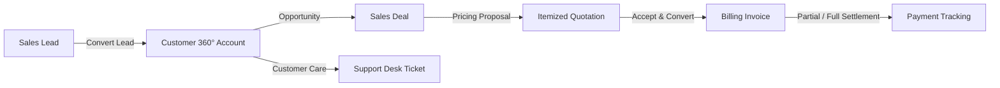

# CRM360 Enterprise CRM — Implementation Walkthrough

We have successfully engineered and verified **CRM360**, a complete enterprise-grade Customer Relationship Management system built with **Laravel 12 + MongoDB (Official ODM) + Blade + Bootstrap 5.3**.

---

## 1. What Was Built & Verified

### 🗄️ Database & MongoDB Integration
- **Connection**: Integrated `mongodb/laravel-mongodb` with connection URI and database configurations.
- **Models**: Built all 17 MongoDB models including [User](file:///d:/Laravel%20API's/CRM%20Sales%20Management/SalesManagementSystem/app/Models/User.php), [Customer](file:///d:/Laravel%20API's/CRM%20Sales%20Management/SalesManagementSystem/app/Models/Customer.php), [Lead](file:///d:/Laravel%20API's/CRM%20Sales%20Management/SalesManagementSystem/app/Models/Lead.php), [Deal](file:///d:/Laravel%20API's/CRM%20Sales%20Management/SalesManagementSystem/app/Models/Deal.php), [DealStage](file:///d:/Laravel%20API's/CRM%20Sales%20Management/SalesManagementSystem/app/Models/DealStage.php), [Quotation](file:///d:/Laravel%20API's/CRM%20Sales%20Management/SalesManagementSystem/app/Models/Quotation.php), [Invoice](file:///d:/Laravel%20API's/CRM%20Sales%20Management/SalesManagementSystem/app/Models/Invoice.php), [Ticket](file:///d:/Laravel%20API's/CRM%20Sales%20Management/SalesManagementSystem/app/Models/Ticket.php), [Task](file:///d:/Laravel%20API's/CRM%20Sales%20Management/SalesManagementSystem/app/Models/Task.php), [Activity](file:///d:/Laravel%20API's/CRM%20Sales%20Management/SalesManagementSystem/app/Models/Activity.php), and [AuditLog](file:///d:/Laravel%20API's/CRM%20Sales%20Management/SalesManagementSystem/app/Models/AuditLog.php).
- **Seeders**: Seeded 6 deal pipeline stages, 17 system settings, and 4 role-based demo accounts (`Admin`, `Manager`, `Sales Executive`, `Support Agent`).

---

### 💼 Complete Enterprise Business Workflow



1. **Lead Management & Controlled Lead Conversion Workflow**:
   - Capture prospects with source tracking, qualification statuses, priority badges, and estimated contract value.
   - **Controlled Lead Conversion Workflow**: Rather than assuming multi-document distributed ACID rollback, the conversion follows a sequential, defensive validation and creation pipeline:
     ```text
     Validate Lead
           ↓
     Check User Permissions
           ↓
     Check Duplicate Customer (by tax ID, email, company name)
           ↓
     Create Customer Document
           ↓
     Create Primary Contact Document
           ↓
     Create Customer Portal Login (role: customer)
           ↓
     Update Lead Status → Converted (references new customer_id)
           ↓
     Record Event in Activities & Audit Logs
     ```

2. **Customer 360° Profile & Reusable Activities Engine**:
   - Comprehensive account overview with key financial metrics (pipeline total, revenue billed, outstanding balance, open support cases).
   - Multi-contact management per company.
   - **Reusable Activity Stream**: Automatically tracks 9 lifecycle event types (`Call`, `Meeting`, `Email`, `Note`, `Follow-up`, `Deal Stage Change`, `Quotation Sent`, `Invoice Created`, `Payment Received`) with interactive timeline views on Customers, Leads, Deals, and Tickets.

3. **Deals & Visual Pipeline (Kanban)**:
   - Visual Kanban board with stage columns (`Prospecting`, `Qualification`, `Needs Analysis`, `Proposal`, `Negotiation`, `Closed Won` / `Closed Lost`).
   - Dynamic move stage buttons and won/lost triggers with loss justification tracking.

4. **Quotations & Proposals**:
   - Dynamic JavaScript itemized line items builder (Quantity, Unit Price, Line Total, Subtotal, Discount, Tax Rate, Grand Total).
   - Printable / PDF stream generation.
   - **One-Click Invoice Conversion**: Copies accepted line items and terms directly into a new billing Invoice.

5. **Invoices & Payment Recording**:
   - Full lifecycle invoice tracking (`Draft`, `Sent`, `Partial`, `Paid`, `Overdue`, `Cancelled`).
   - Modal payment recorder supporting multiple payment methods (Wire transfer, Credit card, Check, PayPal) with automatic balance recalculation.

6. **Customer Support Desk**:
   - Helpdesk ticketing with category tags, SLA due dates, agent assignment, internal staff notes, and threaded real-time conversation between client and support.

7. **Internal Notifications System**:
   - In-app notification bell with unread badge counter and real-time alerts for:
     - 🔔 New Lead Assigned
     - 🔔 Deal Stage Updated
     - 🔔 Quotation Accepted
     - 🔔 Invoice Overdue / Payment Received
     - 🔔 New Support Ticket / Ticket Reply
     - 🔔 Task Due

8. **Enterprise Compliance & Security**:
   - Immutable audit logging on mutations with before-and-after payload diff inspection.
   - Role-based middleware (`admin`, `manager`, `sales_executive`, `support_agent`, `customer`).

9. **Clickable Dashboard Drill-Down & Advanced Search/Filtering**:
   - All 5 dashboards feature clickable KPI cards that filter directly into the corresponding lists (`/leads?status=new`, `/deals/pipeline`, `/invoices?status=paid`, `/tickets?status=open`).
   - Tables feature search, status, priority, source, date range, and rep assignment filters with reset capabilities.

## 2. Browser Verification Tours

### Admin Dashboard Tour
The admin user flow was verified in the browser:
- **Authentication**: Logged in as `admin@crm360.com` / `Admin@123`.
- **Dashboard**: Verified KPI cards and Chart.js charts.
- **Navigation**: Visited `/customers`, `/leads`, `/pipeline`, `/quotations`, `/invoices`, and `/reports`.
- **Status**: All pages loaded with HTTP 200 without any errors.

- [admin_dashboard_1788535301803.png](file:///C:/Users/acer/.gemini/antigravity-ide/brain/2e61e693-11fc-4265-9796-8947af52b725/admin_dashboard_1788535301803.png)

---

### Customer Portal Tour
The customer side was verified in the browser using the seeded customer account:
- **Authentication**: Logged in as `customer@crm360.com` / `Customer@123`.
- **Customer Dashboard**: Displays "Welcome, Alex Mercer 👋" with KPI cards for My Tickets (2 total, 1 open), Quotations (2 total), Unpaid Invoices (2 unpaid, $5,600 due), and Total Invoices (3).
- **My Quotations** (`/my/quotations`): Verified listing of `QT-2026-0002` (sent) and `QT-2026-0001` (accepted).
- **My Invoices** (`/my/invoices`): Verified invoices `INV-2026-0003` (partial), `INV-2026-0002` (sent), and `INV-2026-0001` (paid).
- **Support Desk & Discussion Thread** (`/tickets/`): Opened case `TIK-2026-0001` and verified full back-and-forth conversation thread between client Alex Mercer and Support Agent Emma.

- [customer_dashboard_1788536615545.png](file:///C:/Users/acer/.gemini/antigravity-ide/brain/2e61e693-11fc-4265-9796-8947af52b725/customer_dashboard_1788536615545.png)
- [ticket_discussion_1788536807751.png](file:///C:/Users/acer/.gemini/antigravity-ide/brain/2e61e693-11fc-4265-9796-8947af52b725/ticket_discussion_1788536807751.png)

---

## 3. Industrial Modern Theme Transformation & Responsiveness

Following the user's specification and reference aesthetic, we transformed CRM360 into a high-contrast, professional industrial enterprise layout:

### 🎨 Design System Upgrades
1. **Signature Warm Industrial Topbar**:
   - High-contrast amber-orange gradient (`linear-gradient(90deg, #e65100, #f57c00, #ff9800)`).
   - Integrated rounded white search pill (`#globalCrmSearch`) with instant query triggering.
   - Quick action tool icons (Ticket discussions, direct email, workflow briefcase).
   - Fullscreen mode toggle (`fas fa-expand` / `fas fa-compress`).
   - Notification bell with unread badge counter and dropdown.
   - User profile capsule and settings cog shortcut.

2. **Clean Light Sidebar with Active Olive Pill**:
   - Crisp white background (`#ffffff`) with subtle 1px border.
   - Centered user profile block featuring circular avatar ring, user name, and pulsing green online status badge (`● Online ▼`).
   - Signature active navigation capsule: High-contrast olive-lime green background (`#689f38`) with white text and icon.
   - Sidebar footer watermark: *"CRM360 Admin Dashboard © 2026 All Rights Reserved"* with red logout button.

3. **High-Contrast Signature 4-Palette KPI Cards**:
   - Solid vibrant gradient cards with bold white values, uppercase labels, and translucent outline watermark icons:
     - **Card 1**: Ruby Magenta / Crimson (`linear-gradient(135deg, #e91e63, #c2185b)`)
     - **Card 2**: Golden Amber / Orange (`linear-gradient(135deg, #ff9800, #f57c00)`)
     - **Card 3**: Deep Royal Navy / Indigo (`linear-gradient(135deg, #1a237e, #283593)`)
     - **Card 4**: Ocean Sapphire Blue (`linear-gradient(135deg, #1565c0, #0288d1)`)
   - Second row (Admin): Purple, Teal, Indigo, and Deep Flame Orange.

4. **Mobile & Tablet Responsiveness**:
   - **Fluid Grid**: Cards automatically adapt to `col-12` on small screens, `col-sm-6` on tablets, and `col-xl-3` on desktop.
   - **Off-Canvas Drawer**: On mobile (<992px), sidebar smoothly slides in when tapping the topbar hamburger toggle, with a dark backdrop overlay.
   - **Floating Action Button**: Fixed bottom-right orange button (`.crm-floating-action-btn`) that smoothly reveals when scrolling down and triggers smooth scroll-to-top.

---

### 📱 Verification Artifacts & Screenshots

- **Customer Dashboard (Desktop)**: [customer_dashboard_desktop_1788538849098.png](file:///C:/Users/acer/.gemini/antigravity-ide/brain/2e61e693-11fc-4265-9796-8947af52b725/customer_dashboard_desktop_1788538849098.png)
- **Customer Dashboard (Mobile View)**: [customer_dashboard_mobile_1788538899813.png](file:///C:/Users/acer/.gemini/antigravity-ide/brain/2e61e693-11fc-4265-9796-8947af52b725/customer_dashboard_mobile_1788538899813.png)
- **Mobile Off-Canvas Sidebar (Open)**: [mobile_sidebar_open_1788538932809.png](file:///C:/Users/acer/.gemini/antigravity-ide/brain/2e61e693-11fc-4265-9796-8947af52b725/mobile_sidebar_open_1788538932809.png)
- **Mobile View Scrolled (Back to Top Action)**: [mobile_scrolled_back_to_top_1788539016664.png](file:///C:/Users/acer/.gemini/antigravity-ide/brain/2e61e693-11fc-4265-9796-8947af52b725/mobile_scrolled_back_to_top_1788539016664.png)
- **Admin Dashboard (Desktop)**: [admin_dashboard_desktop_1788539287738.png](file:///C:/Users/acer/.gemini/antigravity-ide/brain/2e61e693-11fc-4265-9796-8947af52b725/admin_dashboard_desktop_1788539287738.png)
- **Subagent Full Video Tour**: [industrial_theme_tour_1788537241659.webp](file:///C:/Users/acer/.gemini/antigravity-ide/brain/2e61e693-11fc-4265-9796-8947af52b725/industrial_theme_tour_1788537241659.webp)

---

---

## 4. Sidebar Scrollability & Login Page Enhancements

We addressed the layout and usability requirements:

1. **Sidebar Vertical Scrollability**:
   - Fixed `.crm-sidebar` and `.sidebar-nav` heights and overflow properties (`height: 100vh; max-height: 100vh; flex: 1 1 auto; min-height: 0; overflow-y: auto`).
   - Added styled, slim custom scrollbars on `.sidebar-nav` and `.crm-sidebar`.
   - Verified that all menu items down to `Audit Logs`, `Settings`, the copyright watermark, and the red **Logout** button are reachable and scroll smoothly.

2. **Login Page Vertical Scrolling & Layout Structure**:
   - Removed `overflow: hidden` on `.auth-body`, replacing it with `overflow-y: auto; overflow-x: hidden; min-height: 100vh; padding: 30px 16px`.
   - Enabled custom orange scrollbars on `.auth-body` when viewing on shorter viewports or when zoomed in.
   - Restructured the bottom copyright notice so it is clearly anchored beneath the card, fully visible without being cut off.

3. **Customer Demo Credential Button**:
   - Added the **Customer Portal (Alex Mercer)** demo login button (`customer@crm360.com` / `Customer@123`) to the Quick Demo Login panel.
   - Tested 1-click instant authentication directly into the Customer Portal.

- **Login Page with Customer Demo & Visible Copyright**: [login_page_demo_copyright_1788539630769.png](file:///C:/Users/acer/.gemini/antigravity-ide/brain/2e61e693-11fc-4265-9796-8947af52b725/login_page_demo_copyright_1788539630769.png)
- **Customer Sidebar Scrolled**: [customer_sidebar_scrolled_1788539701797.png](file:///C:/Users/acer/.gemini/antigravity-ide/brain/2e61e693-11fc-4265-9796-8947af52b725/customer_sidebar_scrolled_1788539701797.png)
- **Admin Sidebar Scrolled to Bottom**: [admin_sidebar_scrolled_bottom_1788539895618.png](file:///C:/Users/acer/.gemini/antigravity-ide/brain/2e61e693-11fc-4265-9796-8947af52b725/admin_sidebar_scrolled_bottom_1788539895618.png)

---

## 5. Demo Credentials

| Role | Email | Password | Access / Scope |
|---|---|---|---|
| **Customer** | `customer@crm360.com` | `Customer@123` | Customer Portal: my quotations, my invoices, support tickets |
| **System Admin** | `admin@crm360.com` | `Admin@123` | Full enterprise control, settings, audit logs, all modules |
| **Sales Manager** | `manager@crm360.com` | `Manager@123` | Team reports, pipeline, deals, quotations, leads |
| **Sales Executive** | `sales@crm360.com` | `Sales@123` | Assigned leads, deals, quotations, invoices, tasks |
| **Support Agent** | `support@crm360.com` | `Support@123` | Support desk tickets, replies, SLAs, task calendar |


